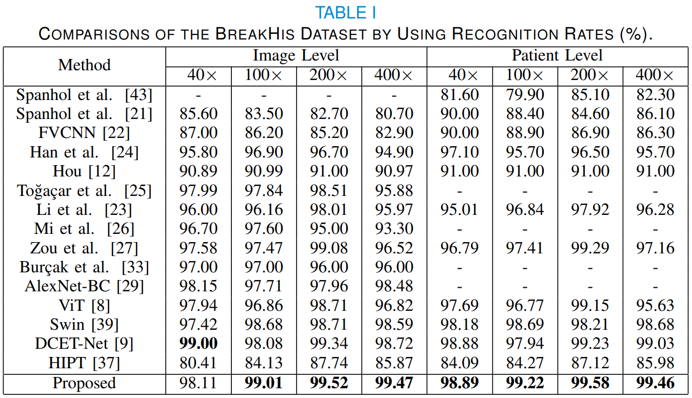
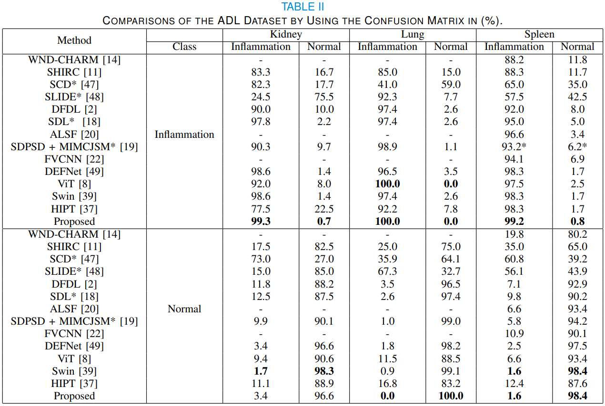
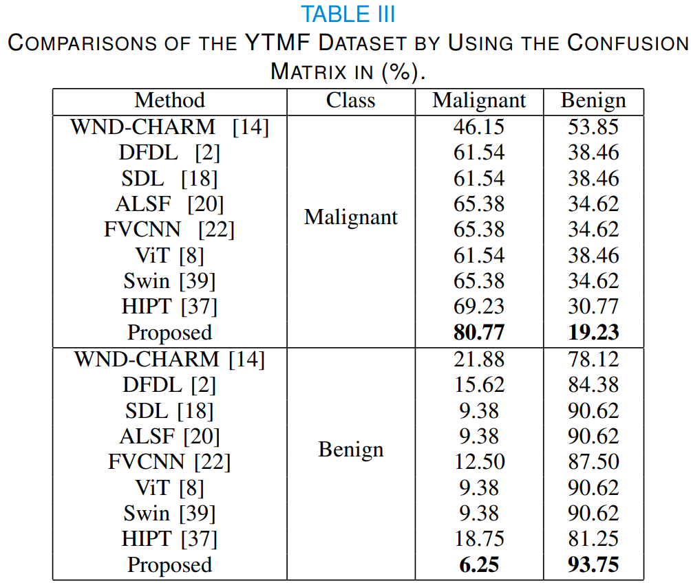

# CSF Transformer

## Cross-Scale Fusion Transformer for Histopathological Image Classification  


## Instruction
First, download the 4 datasets and put them into ``../datasets/``. The URL is in ``../datasets/datasets_URL.txt``.

Second, download the pretrained weight and put it into ``../weights/``. 
https://drive.google.com/file/d/1VDAcBOM1CWzEMD9rfzt5zsuostxvpLI1/view?usp=drive_link

### Requirements
```
pip install -r requirements.txt
```
### Training
```
python main.py --name "training" --dataset "BreakHis" --train
```
### Testing
```
python main.py --name "testing" --dataset "BreakHis"
```
Please download the following weights and put it into ``../weights/`` to reproduce the accuracy.

ADL: Kidney

https://drive.google.com/file/d/1vv0G9HusUlOGJu7QhwMnrcIbKnHh77y4/view?usp=drive_link

ADL: Lung

https://drive.google.com/file/d/1-0CvlUSyJKTFv9jDrOFSVHPlYAKO6GD9/view?usp=drive_link

ADL: Spleen

https://drive.google.com/file/d/1CBzxeBzSPLkNLWEj3x1KN8I-jS8xHksa/view?usp=drive_link

BreakHis

https://drive.google.com/file/d/1WsViy1QWsHylQDsXyMLvEYTTyKogM2l7/view?usp=drive_link

GlaS

https://drive.google.com/file/d/1OEu_opOp4YEv9TAiJQ9NZACj4j9wnRjI/view?usp=drive_link

YTMF

https://drive.google.com/file/d/1y3vtIWX6eXaKO57S9y08RLE2WDYhIIY7/view?usp=drive_link

## Experimental Results





## Reference 
Please cite the following paper when you apply the code. 

S.-K. Huang, Y.-T. Yu, C.-R. Huang and H.-C. Cheng, "Cross-Scale Fusion Transformer for Histopathological Image Classification," in IEEE Journal of Biomedical and Health Informatics, doi: 10.1109/JBHI.2023.3322387.

https://ieeexplore.ieee.org/document/10273605
