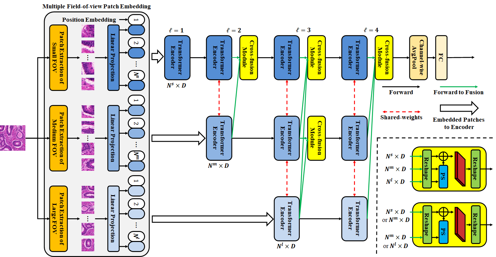

# CSFT (Cross-Scale Fusion Transformer)

Cross-Scale Fusion Transformer for Histopathological Image Classification  

## Usage
First, download 4 datasets and put them into "../datasets/".
Second, download the pretrained weight. 

### Requirements
pip install -r requirements.txt

### Training
python main.py --name "train" --train --dataset "BreakHis"

### Testing
python main.py --name "test" --dataset "BreakHis"
Please download the following weights to reproduce the accuracy.
ADL/Kidney
ADL/Lung
ADL/Spleen
BreakHis
GlaS

## Reference 
Please cite the following paper when you apply the code. 
